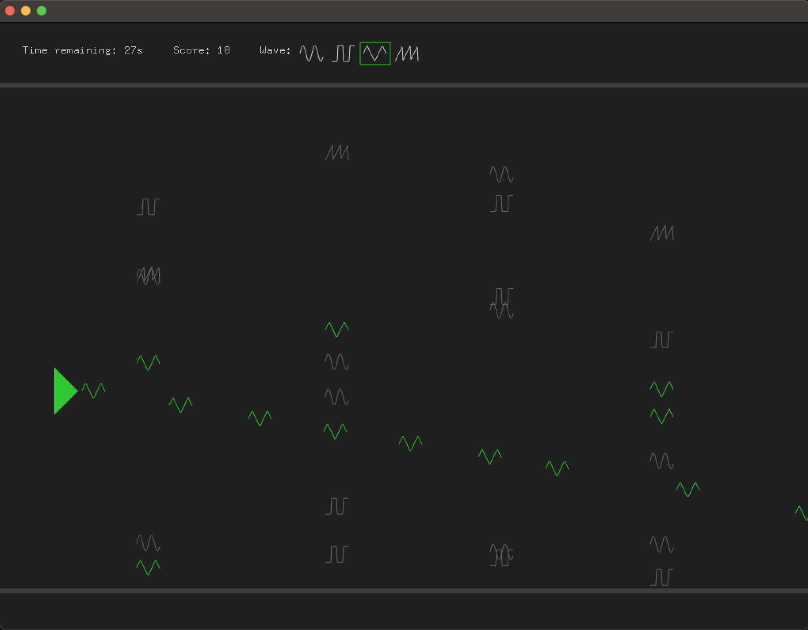

# OHSG - OneHandSynthGame

I wanted to learn more about audio programming and use it in a simple game because that usually leads to fun results and keeps things playful and motivating for me.

The name comes from making people use all fingers on one hand to do synthy gamey things.

## Original idea

As part of the course we had to write an openFrameworks sketch with a simple sine wave oscillator that was later expanded into a theremin-type of sketch.

I wanted to expand upon this and see if I can synthesize the four basic wave shapes and, on top of playing them as sounds, use them as part of a game mechanic.

The idea was to 'shoot' waves that cancel out 'enemy' waves of the same type but also have aural feedback as to what the waves sound like. The frequencies of the projectile waves would be randomly picked from a scale to not sound too random. Success or failure in the game whould be reflected in the synthesized sounds and enemy appearance be influenced by a background track, giving it a rhythm-game kind of style.

## Implementation

I started working on the game structure without any sounds first, just getting controls, shooting, enemy spawning and collision working. This was fairly straight forward but I also wanted to keep the game part to a minimum. In hindsight though I would structure classes differently, mostly merging the logic of projectiles and enemies into one and distinguish them by a flag. That would probably save me lots of code, but I was happy enough when things worked to I'll leave this to future refactoring work(tm).

The hardest part was the audio work. After I tried and failed to access buffer data of the background track while also synthesizing, I decided to just let the background track play and focus on synthesis. (If the problem here was my understanding of underlying audio, C++ or openFrameworks I cannot say). In the end I started a new openFrameworks sketch just for synthesis and merged it later with the game sketch.

Also, I completely underestimated the brain cells I would need to wrap my head around implementing wavetable synthesis ([openFrameworks Audio Programming Tutorials on YouTube is your friend](https://www.youtube.com/watch?v=_QX4ZdlsqSQ&list=PLNURizt7mHsJ9EasygZJl7M3e-kAOV9Pa). And even now I think I only roughly get it.

As a result, the code around the audio is not very good. Ideally I'd populate the wavetables once in the beginning and then only use them as look-up tables depending on the current type of wave. Right now though I repopulate the current table on every wave change. Unnecessary! Same goes for the drawing of the projectiles/ enemies. At the moment they are all drawn as polylines, looping over every representation. Either this should be drastically simplified (eg using a bitmap image or something) or I should actually make use of potential to adjust the visuals.

But I left it as it is because at least it's working and struggling with audio concepts while battling C++ is defintely a recipe for headache.

## Final result

The resulting game is far from what I imagined. But I did learn more about audio programming along the way and maybe even a little more C++.
